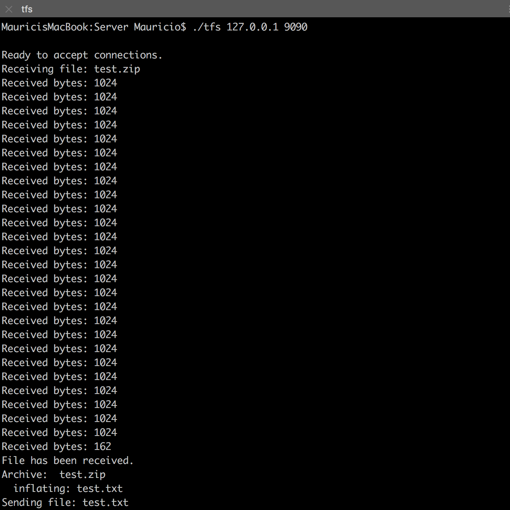
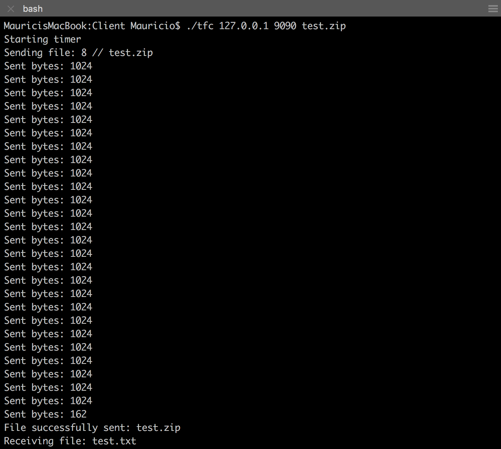
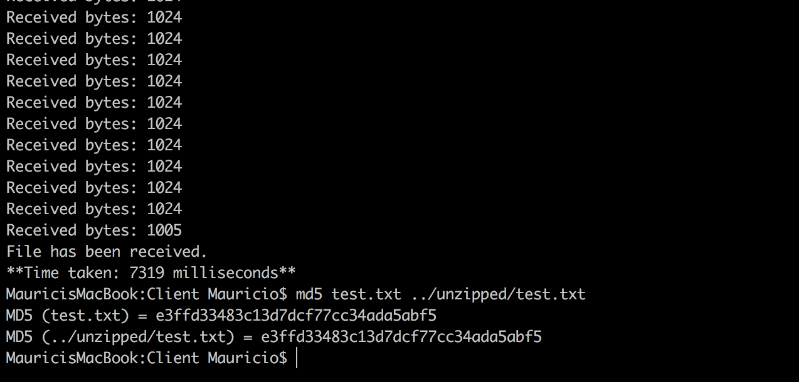

# TCP Unzip File Transfer

A server side application that listens and establishes connections to clients  through the TCP protocol. Once the connection is established, the client application transfers a zipped file to the server. The server receives the file, unzips it and transfers it back to the client.

## Getting Started
A sample zipped text file is provided in the Client folder. The unzipped file is named ```test.txt``` in the unzipped folder and can be used to verify that the file was transferred and unzipped correctly.

Start by compiling the files.

### On the Server Machine
```
gcc tfs.c -o tfs
```
### On the Client Machine
```
gcc tfc.c -o tfc
```

## Running the Applications
### Server
To run the server side application:
```
./tfs 127.0.0.1 9090
```

change ```127.0.0.1``` and ```9090``` to be the IP address and Port number.

### Client
To run the client side application:
```
./tfc 127.0.0.1 9090 test.zip
```

change ```127.0.0.1``` and ```9090``` to match the server's IP address and Port number. Change ```test.zip``` to match the file to be sent to the server.

## Result
Comparing the results show that the unzipped file received on the client side correctly matches the previously stored unzipped file.

